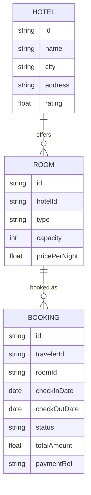

# Domain Model

The catalog of hotels and rooms is held by `hotel-booking-api`; a booking ties a traveler (identified by the sign-in subject) to one room for a date range, with a payment reference from the internal payments API.

`BOOKING.travelerId` is the sign-in subject of the traveler who made it — every booking read or write is scoped to it. `status` moves from `confirmed` to `cancelled`; there is no `pending`/held state since payment is taken at booking time.