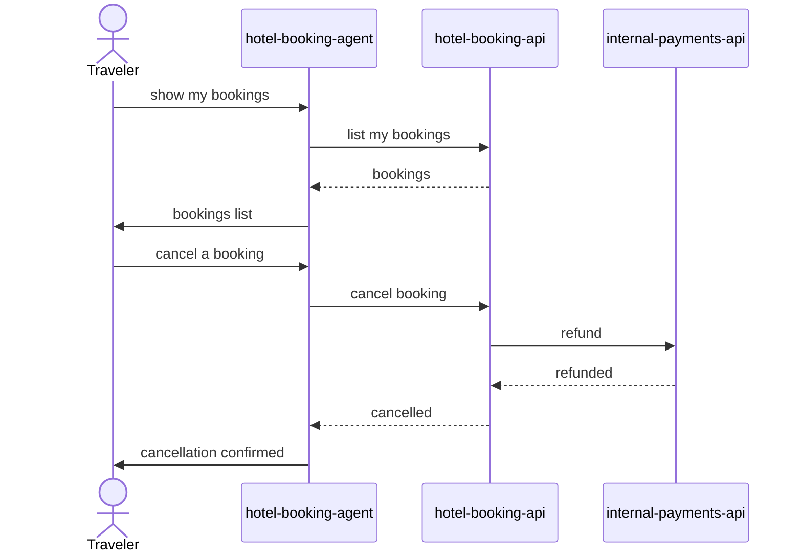

# Manage existing bookings

A traveler asks the agent to see their upcoming stays, and cancels one.

```mermaid
sequenceDiagram
    actor Traveler
    participant hotel-booking-agent
    participant hotel-booking-api
    participant internal-payments-api

    Traveler->>hotel-booking-agent: show my bookings
    hotel-booking-agent->>hotel-booking-api: list my bookings
    hotel-booking-api-->>hotel-booking-agent: bookings
    hotel-booking-agent->>Traveler: bookings list
    Traveler->>hotel-booking-agent: cancel a booking
    hotel-booking-agent->>hotel-booking-api: cancel booking
    hotel-booking-api->>internal-payments-api: refund
    internal-payments-api-->>hotel-booking-api: refunded
    hotel-booking-api-->>hotel-booking-agent: cancelled
    hotel-booking-agent->>Traveler: cancellation confirmed
```

